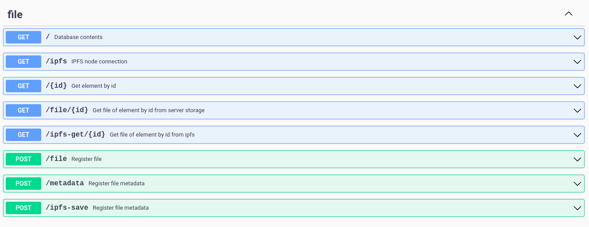
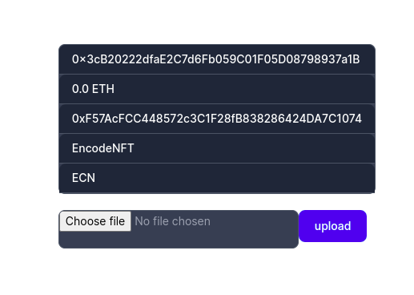

# Weekend Project 4

## network goerli
### nft contract address => 0xF57AcFCC448572c3C1F28fB838286424DA7C1074
- deployment hash 0xb05114f8c9308bf8781bf89c2c1e1ce151644919240afc48f85d3abbb5486a91
- minting hashes
- 0xd5006295aa70bf9e67cc48a890a501e8b7b04b601afec0cfc217555ea48340a3
- 0xfda0a90ee31e6a8cc491f5a3331e1661943b7e9faedd8c7fd8cb2623aa791a54
- 0xb7be47074250efb5737ca69828f39bcb9cb8092437b7eeb061d8342cc336ec11
- 0x4978c8f992bc56e89a779484502796a59e1f4d19c07bf3f20cce489005e14353
- 0x2f341e6c88c5e6cc2888225441662b699def2b908e780fa21d03c7404f06ed57
- 0xada79c3fa1ae93472bce660ee9522adfb5460e95159943eff6708af9fd45be4f
- 0x58ccc9895de9e45ab78dfbcae8f72a1b62be964b8b218f67775eb7efca811f49
- 0x79969100727e5239f38e3acc3dec1a30360a893c3b74e653f1c4de73d113ff26
- 0x04c4626f1f264a5b822b0ac9f9f4dfbdcdf98e5abcef0a69a144127ce1f16099
- 0x244073c198db8bdb6092f443078e882c83ce1f85baf1d042cc7c0479a4b6d8c9

### swagger ui

### frontend ui

### CIDs of images at IPFS

